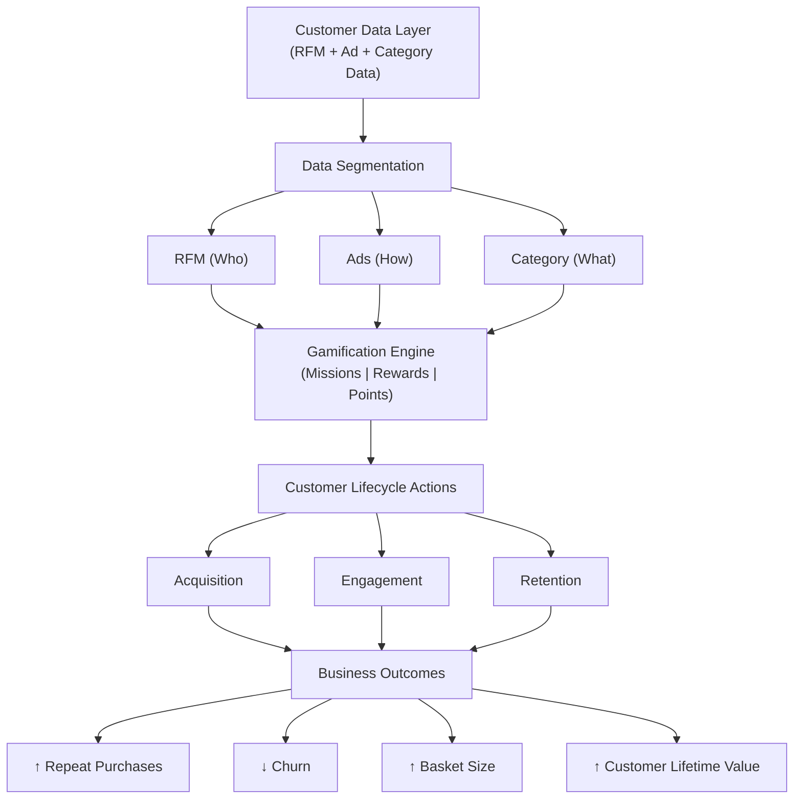

# RFM Customer segmentation Analysis

Marketing and CRM teams lack clear visibility into which customers drive revenue and which are disengaging, leading to inefficient campaigns and missed opportunities. RFM analysis addresses this by segmenting customers based on purchasing behavior, providing clarity on customer value and engagement.

This enables teams to focus on high-value customers for retention while identifying at-risk users for timely re-engagement. As a result, businesses can shift from generic campaigns to targeted strategies, improving marketing efficiency, customer lifetime value, and overall growth.

## Table of Contents

1. [Project Overview](#project-overview)
2. [Data Structure](#data-structure)
3. [Executive Summary](#executive-summary)
4. [Insights Deep-Dive](#insights-deep-dive)
5. [Recommendations](#recommendations)
6. [Tech Stack](#tech-stack)
7. [Loyalty Program](#loyalty-program)
  
---

## Project Overview

This project builds a **Customer Retention Intelligence Dashboard using RFM analysis** to help marketing and growth teams better understand customer behavior and take targeted actions. By analyzing purchase patterns across **Recency, Frequency, and Monetary value over a yearly dataset,** customers are assigned scores and grouped into meaningful segments such as high-value, potential, and at-risk users. This segmentation enables stakeholders to **identify where to focus retention efforts, reduce customer churn**, and design more effective engagement strategies, ultimately improving customer lifetime value and overall business performance.

To ensure scalability and real-world applicability, the project is implemented using a **cloud-based analytics pipeline**. Data cleaning and transformation are performed in **Google BigQuery using SQL (including CTEs and conditional logic)**, where RFM metrics are computed and structured into analysis-ready datasets. This data is then **connected to Tableau for live, interactive visualization**, enabling real-time exploration of customer segments without manual intervention. T**he end-to-end pipeline is fully automated**, reflecting how modern data teams build efficient, always-updated reporting systems for business stakeholders.

Beyond segmentation, this project is part of a broader effort to **move from analysis to decision-making**. By combining insights from this RFM model with ad performance data and category-level insights, **the goal is to design a behavior-driven loyalty program for an e-commerce business**. This demonstrates the ability to not only analyze data but also translate insights into actionable strategies that drive retention, optimize marketing efforts, and create measurable business impact.

**Live Tableau RFM Dashbaord:** [Dashboard Link ](https://public.tableau.com/app/profile/harender.singh1204/viz/rfm_analysis_dashboard/rfm_Daashboard2)

---
## Data Structure
| Field Name       | Data Type     | Business Description                                             |
|------------------|---------------|------------------------------------------------------------------|
| **OrderID**      | String / ID   | Unique key to count transactions for the Frequency score         |
| **CustomerID**   | String / ID   | Unique identifier used to aggregate all metrics per customer     |
| **OrderDate**    | Date          | Identifies latest purchase to calculate the Recency score        |
| **ProductType**  | String        | Contextual data for segment-specific cross-selling strategies    |
| **OrderValue**   | Float         | Summed to calculate the total Monetary value per user            |

**Calculation Logic**

- **Recency   :** Days elapsed since the maximum OrderDate per customer.  
- **Frequency :** Total count of unique OrderID entries per customer.  
- **Monetary  :** Total sum of OrderValue per customer.

---

## Executive Summary

This analysis evaluates customer behavior over a one-year period using RFM segmentation across 287 customers to identify retention opportunities and churn risks. The results show that a large portion of customers remain in early and mid-engagement stages, with **Engaged (21.3%) and Promising (15.7%)** forming the largest segments, indicating consistent interaction but limited progression toward high-value, loyal customers over time.

However, only **7.7% of customers fall into the Champions segment**, highlighting a gap in converting active users into high-value, repeat buyers even over a longer duration. At the same time, **24% of customers fall into At Risk and Require Attention segments**, signaling sustained churn risk that requires proactive intervention.

These insights suggest a **need to strengthen conversion from mid-value segments (Promising, Potential Loyalists) into loyal customers**, while implementing timely re-engagement strategies for declining users. Focusing on these areas can improve customer retention, increase repeat purchase behavior, and drive long-term revenue growth.

--- 
## Insights Deep-Dive

   * A large portion of customers falls into the **Engaged segment (21.3%)**, while **only 7.7% are Champions**, indicating strong initial interaction but limited conversion into high-value, loyal customers. This highlights a gap in progressing users through the customer lifecycle.
     
   * **Promising (15.7%) and Potential Loyalists (14.3%) together form 30% of the customer base**, representing the strongest opportunity for growth. These customers show repeat behavior and can be converted into loyal users through targeted engagement strategies.
     
   * Approximately **24% of customers fall into At Risk and Require Attention segments**, signaling early-stage churn risk. Without timely intervention, these customers are likely to transition into inactive segments, leading to revenue loss.
     
   * The Lost segment remains low (2.4%), indicating that the customer base is still in an early lifecycle stage. This presents an opportunity to proactively build loyalty before churn increases.

---

## Recommendations

   * **Convert Engaged Users into Loyal Customers:** The high share of Engaged users (21.3%) compared to low Champions (7.7%) highlights a gap in converting active users into repeat buyers. Targeted repeat purchase campaigns within 7–15 days, supported by personalized recommendations and second-order discounts, can address this.
   
     These actions encourage additional transactions and stronger engagement. As a result, purchase frequency increases and more users move into Loyal and Champion segments.

   * **Activate Mid-Value Segments (Promising + Potential Loyalists):** 30% customers are close to becoming loyal but not fully converted. To capitalize on this, milestone-based rewards (e.g., “Buy 2 more times → unlock ₹500 reward”) and bundle offers should be implemented to encourage repeat purchases and increase basket size.

     These actions help nurture customers at a critical stage in their lifecycle. As a result, this segment can be effectively converted into loyal customers, driving higher revenue growth.

* **Reduce Churn from At Risk Customers:** 24% customers are At Risk or require attention indicating a high likelihood of churn if not addressed. To mitigate this, automated re-engagement campaigns should be triggered after 20–30 days of inactivity, supported by time-limited offers to create urgency and encourage return purchases.

  These actions can prevent customers from moving into the Lost segment and recover potential revenue from existing users.

---

## Tech-Stack

## 🔗 Tech Stack → Business Impact Mapping  

| Tool / Technology | Use  | Business Impact |
|------------------|------------|-----------------|
| Google BigQuery | Processed and transformed raw transactional data on cloud using scalable queries | Enabled handling of large datasets efficiently and ensured faster, reliable data processing for real-time analysis |
| Advanced SQL (CTEs, Views, CASE) | Built logic to calculate RFM metrics, assign scores, and create customer segments | Transformed raw data into actionable customer insights for retention and churn analysis |
| Tableau | Developed interactive dashboards with live data connection | Enabled stakeholders to explore customer segments in real time and make faster, data-driven decisions |
| ChatGPT | Assisted in structuring analysis, refining insights, and improving documentation | Improved clarity of business storytelling and strengthened decision-focused communication |
| Google AI Overview & Gemini | Provided business context, use cases, and best practices | Enhanced analytical depth and ensured recommendations aligned with real-world business scenarios |

## Loyalty Program

This loyalty program was built to demonstrate capabilities beyond data cleaning and analysis, showcasing the ability to understand business problems and design actionable, data-driven solutions. It reflects a shift from identifying insights to applying them in a way that can create real business impact.

The program is developed by integrating insights from **three key analytics projects—Quick Commerce Category & Clubhouse Optimization, Meta Ad Performance Analysis, and RFM Customer Segmentation**. By combining customer behavior, engagement patterns, and product preferences, it creates a unified view of how customers interact with the business.

It helps the business by providing a structured, **data-backed approach to improving retention and reducing churn.** Instead of generic strategies, it enables targeted loyalty actions based on real customer behavior, ultimately driving repeat purchases, improving customer lifetime value, and supporting sustainable growth

## Case Study

Aditi, a 24-year-old user, places her **first order** on the platform after **interacting with an Instagram ad**. Based on her behavior, she is categorized as an **“Engaged” user in the RFM model**.

Immediately after her first purchase, she **enters the “Starter Quest”** where she is encouraged to complete her second order within 7 days to unlock a reward. She **receives personalized product recommendations** based on her previous purchase along with a limited-time discount, motivating her to place another order.

As she continues purchasing, Aditi moves into the **“Promising” segment** and unlocks the **“Growth Quest.”** Here, she is encouraged to explore new categories such as healthy and low-fat products through curated bundles and milestone-based rewards. This increases both her purchase frequency and basket size.

After a period of inactivity, Aditi is identified as an **“At Risk” customer**. She receives a personalized re-engagement notification with a time-bound offer and a reminder of her reward progress. She returns to complete a purchase, preventing churn.

Over time, Aditi progresses into the **“Loyal” and eventually “Champion” segment**, where she gains access to exclusive benefits such as early deals, bonus points, and premium rewards.

                    Acquire → Activate → Engage → Recover → Retain

## Customer Lifecycle Flow (Gamified Loyalty Journey)

**Acquire**  
- Ad Exposure (Instagram / Meta Ads)  
- Aditi Clicks Ad → Lands on Platform  
- First Purchase Completed  
- Aditi Tagged as "Engaged" (RFM)  

**Activate**  
- Starter Quest Triggered (2nd Order Challenge)  
- Personalized Product Recommendations  
- 2nd Order Discount Offered  
- Aditi Completes Second Purchase  

**Engage**  
- Aditi Moves to "Promising Segment"  
- Growth Quest Activated  
- Milestone Tasks (e.g., 3 Orders / Category Exploration)  
- Bundle & Low-Fat Product Recommendations  
- Increased Purchase Frequency & Basket Size  
- Aditi Becomes "Potential Loyalist"  

**Recover**  
- Aditi Becomes Inactive (20–30 Days)  
- Moves to "At Risk Segment"  
- Comeback Mission Triggered  
- Time-Limited Offer (24–48 hrs)  
- Retargeting Ads (Story Format)  
- Aditi Returns & Makes Purchase  

**Retain**  
- Aditi Moves to "Loyal Segment"  
- Unlocks Advanced Rewards  
- Earns Bonus Points & Exclusive Offers  
- Early Access to Deals  
- Becomes "Champion Customer"
